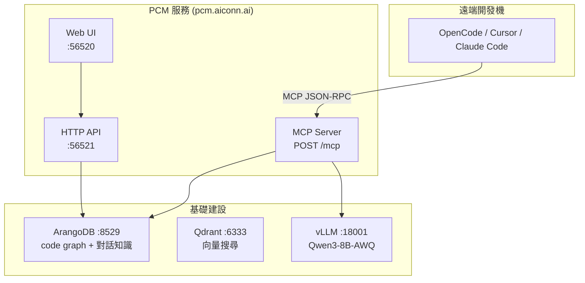
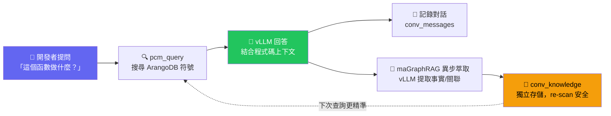
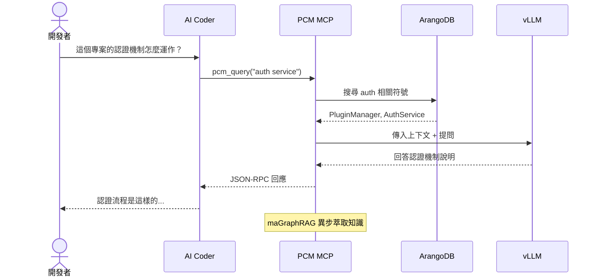
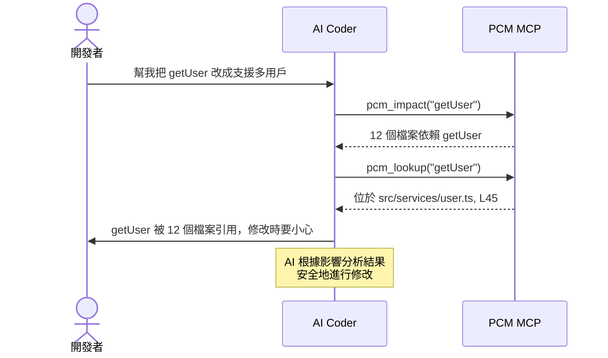
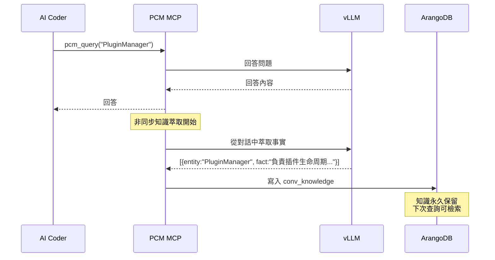

# PCM MCP 整合指南

PCM 提供符合 MCP (Model Context Protocol) 標準的遠端 JSON-RPC 端點，任何支援 MCP 的 AI Coding 工具都能連接。

## 端點資訊

```
URL:       https://pcm.aiconn.ai/mcp
Transport: HTTP POST (JSON-RPC)
Auth:      無需認證（可搭配 Cloudflare Tunnel 保護）
```

## 可用工具（9 個）

| Tool | 說明 | 必要參數 |
|------|------|---------|
| `pcm_project_list` | 列出已掃描專案 | 無 |
| `pcm_project_status` | 查看專案掃描狀態 | `project` |
| `pcm_scan` | 掃描專案，建立 CodeGraph | `path` |
| `pcm_graph` | 取得專案依賴圖 | `project` |
| `pcm_lookup` | 查詢程式碼符號 | `project`, `name` |
| `pcm_hotspots` | 複雜度熱點 | `project` |
| `pcm_impact` | 影響分析（改了 X 會影響誰） | `project`, `target` |
| `pcm_cycles` | 循環依賴檢測 | `project` |
| `pcm_query` | GraphRAG 問答 + maGraphRAG 萃取 | `question`, `project`(可選) |

## 各工具設定方式

### OpenCode

編輯 `~/.opencode.json` 或專案根目錄的 `.opencode.json`：

```json
{
  "mcpServers": {
    "pcm": {
      "url": "https://pcm.aiconn.ai/mcp",
      "transport": "http"
    }
  }
}
```

### Claude Code (Anthropic)

編輯 `~/.claude/claude_desktop_config.json` 或專案 `.mcp.json`：

```json
{
  "mcpServers": {
    "pcm": {
      "url": "https://pcm.aiconn.ai/mcp",
      "transport": "http"
    }
  }
}
```

### Cursor

在專案根目錄建立 `.cursor/mcp.json`：

```json
{
  "mcpServers": {
    "pcm": {
      "url": "https://pcm.aiconn.ai/mcp",
      "transport": "http"
    }
  }
}
```

### Antigravity

編輯設定檔（通常為 `~/.antigravity/mcp.json`）：

```json
{
  "mcpServers": {
    "pcm": {
      "url": "https://pcm.aiconn.ai/mcp",
      "transport": "http"
    }
  }
}
```

### Codex (OpenAI)

編輯設定檔（`~/.codex/config.json`）：

```json
{
  "mcp": {
    "pcm": {
      "url": "https://pcm.aiconn.ai/mcp",
      "transport": "http"
    }
  }
}
```

### 通用格式（所有 MCP 相容工具）

幾乎所有支援 MCP 的 AI Coding 工具都使用相同的 JSON 結構：

```json
{
  "mcpServers": {
    "服務名稱": {
      "url": "MCP 端點 URL",
      "transport": "http | stdio | sse"
    }
  }
}
```

## 使用場景

## 架構



## 核心閉環（maGraphRAG）



## 使用流程

### 場景 1：理解陌生專案



### 場景 2：安全修改代碼



### 場景 3：知識累積（maGraphRAG）



## 安全建議

1. 使用 Cloudflare Tunnel 保護端點（`pcm.aiconn.ai` 已設定）
2. 可考慮加入 API Key 驗證：
   ```json
   "pcm": {
     "url": "https://pcm.aiconn.ai/mcp",
     "transport": "http",
     "headers": { "Authorization": "Bearer YOUR_API_KEY" }
   }
   ```
3. 所有代碼分析都在本機執行，不會上傳原始碼到外部服務
